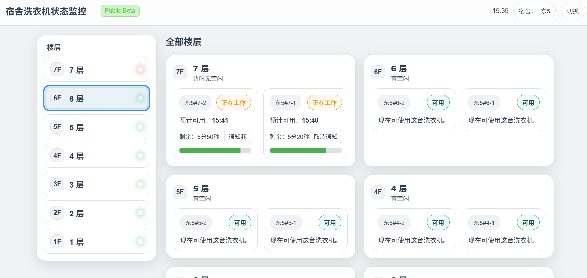
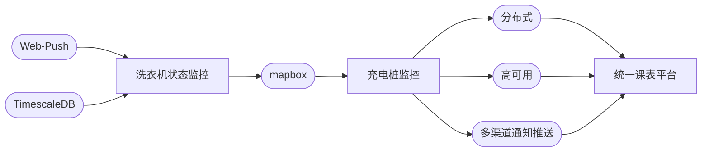

# 洗衣机状态监控后端 使用说明书

> 请仔细阅读本说明书并在当地律师的指导下使用。

**【通用名称】**  
洗衣机状态监控后端

**【英文名称】**  
Laundry Status Monitor

**【适应症】**  
主要用于缓解宿舍等公共洗衣房的两类常见不适：

1. 官方程序（海乐生活）找机器不便：全校设备堆叠于单一列表，检索与定位困难。
2. 状态监控繁琐：官方程序预计可用时间不准确，需反复查看或手动设闹钟。

**【成分】**  

本品主要成分为 (Golang-Vue) B/S 前后端分离项目。  
软件工程名称：(Golang-Vue) B/S 前后端分离项目  
分子式：$Golang_1Vue_1$  

**【性状】**  

本品为一套可自托管的后端服务，提供设备发现、状态抓取、事件判定与 Web-Push 通知等功能；可单体运行，亦可与前端/其他服务协同服用。

**【规格】**

- [x] 海乐生活 API 爬取
- [x] 通知推送
- [x] 洗衣机可用区间记录
- [ ] 洗衣机历史状态查询

**【用法用量】**

容器化或裸机部署均可。根据环境选择合适的进程管理与日志采集方案。  
建议结合设备规模与平台限制进行配置，常见范围 *30–120 秒/轮*；频率过高可能触发风控。  

**【快速开始】**：

  1. 配置目标校区/楼栋及设备筛选条件
  2. 配置 Web-Push 需求的 VAPID 密钥对
  3. 设置抓取频率与通知策略
  4. 启动服务并观察日志、校验通知链路

**【注意事项】**

1. 合规与隐私：  
   1\) 仅抓取设备公开状态，不采集个人敏感信息。  
   2\) 请遵循平台的使用条款及当地法律。
2. 监控稳定性。平台接口变更时需及时适配。

**【不良反应】**  
网络延迟愈高，不良反应愈明显。
1. 常见的有漏报、延迟等网络波动反应，选用网络质量好的服务器可缓解。
2. 接口一致性：目标平台 API 重大调整导致抓取中断。

**【禁忌】**

1. 不适用于未接入海乐生活平台的设备环境。
2. 对秒级实时性极度敏感且无本地传感器补充的场景不建议仅依赖本品。

**【相互作用】**

尚不明确。

**【药理机制】**  
通过周期性抓取设备状态，结合规则/阈值识别关键事件，写入时间序列数据库形成“可用区间”，并通过 Web-Push 触达用户；可选前端用于空间可视化与历史观察。  

**【技术路线】**  
本项目为开发商学习 Web-Push 和 TimescaleDB 时的练手工程。  

**【临床表现】**  
示例站点：[https://laundry-status.bllxl.com](https://laundry-status.bllxl.com)

**【储藏】**  

1. 定期备份数据库与配置；监控抓取成功率、推送送达率与告警量。
2. 版本升级前在灰度环境回归关键路径；保留至少 7–14 天运行日志以便排查。

**【执行标准】**  
ISO 29110

**【规格与包装】**  
以源码形式发布。
